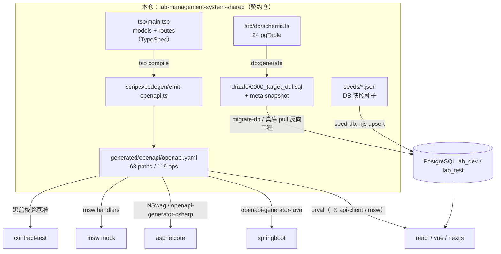
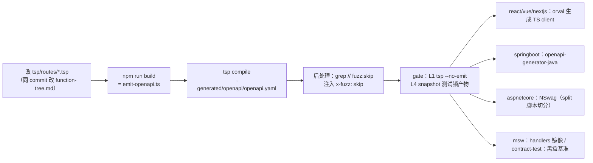
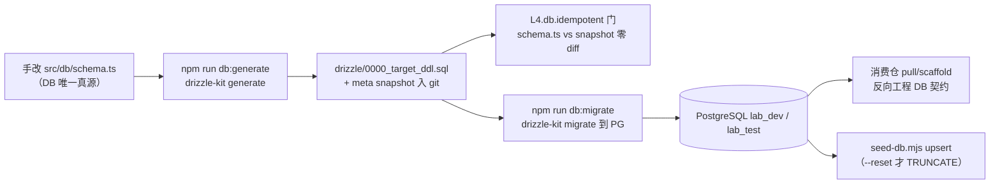

# lab-management-system-shared 架构

> 一句话定位：lab-management-system 多仓家族的契约仓（dual SSOT）——`tsp/` 产出 API 契约（TypeSpec → OpenAPI yaml），`src/db/schema.ts` 产出 DB schema（Drizzle schema-first → SQL baseline），供 6 个消费仓各自 codegen / 反向工程。

生成日期：2026-09-22 ｜ 锚定 HEAD：88a9b32 ｜ 生成方式：DeepWiki 风格架构扫描

## 1. 总览

- **家族角色**：契约仓（6 角色中的 shared 契约仓）。家族拓扑：本仓 → 3 前端（react :5202 / vue :5203 / nextjs :5201）+ 2 后端（aspnetcore :5204 / springboot :5205）+ 1 mock（msw :5200），另有 contract-test 仓黑盒校验「前端不可区分」。
- **双 SSOT**（ADR-0025 schema-first，取代 ADR-0007 手写 SQL）：
  - API 真源：`tsp/main.tsp` + `tsp/models/*.tsp` + `tsp/routes/*.tsp`，只 emit OpenAPI yaml（`generated/openapi/openapi.yaml`），禁止手写 yaml、禁止生成语言专属客户端。
  - DB 真源：`src/db/schema.ts`（手写 Drizzle schema，804 行，24 张 pgTable），由 `npm run db:generate` 物化为 `drizzle/0000_target_ddl.sql` + snapshot 入 git；`drizzle-kit generate` 零 diff 是 `L4.db.idempotent` 门。
- **技术栈与版本**（钉死于 `version-lock.json`）：TypeSpec compiler ^1.0.0 / @typespec/http ^1.15.0 / @typespec/openapi3 ^1.0.0 / TypeScript ^5.7.0 / Vitest ^2.1.0 / drizzle-orm ^0.36.4 / drizzle-kit ^0.28.1（drizzle 与 pg/postgres 均为 devDep，ADR-0025 D3 豁免；禁止 npm runtime 依赖）。Node >= 20。
- **规模速览**：13 个路由 .tsp（12 个业务 + 已废除的 `_exempt.tsp` 注释壳）、11 个 model .tsp、24 张 DB 表、63 个 OpenAPI path / 119 个 operation（`generated/openapi/openapi.yaml`，6156 行）、24 个种子 JSON（`_meta.json` 记 23 表 / 4377 行，dump 自 lab_dev @ 2026-08-23）、7 个测试文件共 566 行。

## 2. 系统架构

关键边界：本仓**不含任何业务代码**（handlers/services/controllers 禁止），语言专属客户端（TS/Java/C#）一律下放消费仓自己 generate。对外只有一个 API 面出口（`package.json` exports 仅 `"." → main.tsp` 与 `"./openapi" → openapi.yaml`）和一个 DB 面出口（schema.ts 物化产物 + 种子灌库脚本）。`tsp/routes/_exempt.tsp` 已于 2026-09-17 废除为纯注释——豁免逻辑下沉到 inventory 算法（ADR-0034），不再接受清单式人工豁免。

## 3. 模块分解

| 模块/目录 | 职责 | 关键文件 |
| :--- | :--- | :--- |
| `tsp/` 根 + `main.tsp` | API 契约入口：`@service @route("/api") namespace Lab.Management.Shared`，import 全部 models/routes；定义 `Page<T>` / `ErrorResponse` / `CreatedResponse` 通用形状；范围 M01 认证 / M02 资源 / M03 试验过程 / M04 基础数据 / M05 统计 / M06 检测能力 | `main.tsp`（77 行） |
| `tspconfig.yaml` | emitter 配置：仅 `@typespec/openapi3` 一个 emit 目标（语言无关中间产物的唯一出口） | `tspconfig.yaml` |
| `tsp/models/`（11 文件） | 业务 DTO：sample、sample-receipt、test-record、contract、inspection-catalog、inspection-dictionary、technical-requirement、report-name、calculation-method、param-interface、common | `tsp/models/common.tsp` 等 |
| `tsp/routes/`（12 业务文件） | 端点定义：auth、contracts、sample-receipts、samples、test-records、inspection-catalog、inspection-dictionary、report-names、calculation-methods、param-interfaces、technical-requirements、summary | `tsp/routes/auth.tsp`（152 行）等 |
| `tsp/contracts/` | 前端绑定契约（Sprint 1：auth 4 态状态机 + 持久化 key 命名；4-backend 切换部分已 @deprecated，ADR-0014） | `tsp/contracts/frontend-bind.tsp` |
| `src/db/` | DB DDL 真源（ADR-0025 schema-first）：24 张 pgTable，含租户隔离列、字典 junction 图、cascade 链；时间列与 tenant_id 为 TEXT 默认 ''（V001 历史设计） | `src/db/schema.ts`（804 行） |
| `scripts/codegen/` | emit 流水线：自举 tsp 依赖 → `tsp compile` → 后处理注入 `x-fuzz: skip`（ADR-0036：`// fuzz:skip` 注释锚点映射为 vendor 扩展，codegen 默认忽略 x- 字段） | `scripts/codegen/emit-openapi.ts`（115 行） |
| `scripts/`（DB 工具） | 灌库 / 迁移 / 重建 / 幂等门 / 模板同步 | `seed-db.mjs`（upsert 幂等，PK 从 information_schema introspect，`--reset` 才 TRUNCATE）、`migrate-db.mjs`（drizzle-kit migrate，替代 sync-db.mjs）、`rebaseline-db.mjs`（破坏性重建，需 `NODE_ENV=production` + `PG_REBASELINE_ALLOW=1` 双闸）、`check_drizzle_idempotent.py`、`sync-templates.mjs`（read+write 拷贝规避 Node 24 Windows cpSync 中文文件名崩溃） |
| `drizzle/` | schema 物化产物（入 git）：baseline DDL + snapshot + journal | `drizzle/0000_target_ddl.sql`、`drizzle/meta/0000_snapshot.json` |
| `seeds/` | 家族种子权威源（PG 快照形状，源 lab_dev；2026-09-15 自 lab-nextjs 迁入）；与 msw 仓双源共存期约定：改种子须同 commit 同步 msw 对应数据 | `seeds/*.json`（24 个）、`seeds/_meta.json` |
| `assets/templates/` | 报告模板（docx + inject.json 注入数据），由 `sync-templates.mjs` 分发到消费仓 | `assets/templates/101_水泥检测报告.docx` 等 |
| `tests/` | 契约与 DB 一致性测试（详见 §7） | `tests/drizzle.replay.test.ts`（281 行）、`tests/snapshots/openapi.test.ts`、`tests/fnReporter.ts` |
| `docs/` | 仓内架构文档 / 功能树 | `docs/ARCHITECTURE.md`（682 行，长篇版）、`docs/functions/function-tree.md`（428 行，与 tsp/routes 一一对应的双账本） |
| 根部账本文件 | 版本锁定 / 变更日志 / 待办 / codegen 工具配置 | `version-lock.json`、`CHANGELOG.md`、`PLAN.md`、`openapitools.json`、`drizzle.config.ts`、`vitest.config.ts`（testTimeout 10s，reporter 含自定义 `FnReporter`） |
| `backups/` | 重建库前的全量 JSON 备份与配套工具（rebaseline 前置义务：先备份） | `backups/lab_dev-backup-20260913.json`、`backups/dump-json.mjs`、`backups/restore-db.mjs`、`backups/catalog-diff.mjs` |

## 4. 数据流 / 请求生命周期

代表性链路：**改一次 API 契约 → emit → 六仓 codegen 同步**（本仓即第 1-2 段，后续为消费仓动作）。

DB 侧对偶链路：改 `src/db/schema.ts` → `npm run db:generate` 产出 `drizzle/` diff 入 git（禁止手改 `drizzle/*.sql`）→ `migrate-db.mjs` apply 到 PG → 消费仓从真库 pull/scaffold 反向工程。

约束红线：**本仓是 API 增/改的源头，改 `tsp/routes/*.tsp` 必须与 4 后端 + msw + contract-test 仓同 commit 同步**，否则家族契约静默破裂（CI 不报警）。

## 5. 依赖面

- **对外产出（被依赖）**：`generated/openapi/openapi.yaml`（npm exports 唯一暴露面）被 react/vue/nextjs（orval）、springboot（openapi-generator-java）、aspnetcore（NSwag）、msw（handlers 镜像）、contract-test（黑盒基准）消费；消费仓 CI fresh clone 不 install——`emit-openapi.ts` 内置自举逻辑（本地缺 `tsp` 二进制则先 `npm install`），防 npx 拉到 npm 上的 `tsp@0.0.1` 老 Microsoft 包。
- **code 路径借用**：`tests/drizzle.replay.test.ts` 通过 `createRequire` 借 sibling `lab-management-system-nextjs` 的 `pg`（sibling 源码 import 需要 sibling node_modules 的家族已知约束）。
- **对家族其他仓**：种子双源共存——`seeds/` 改动必须同 commit 同步 `lab-management-system-msw` 的 seeds/fixtures（语义对齐，形状不同：本仓 DB 列形状 / msw API 形状）；模板同步目标为 react 等 4 个消费位（`scripts/sync-templates.mjs` CONSUMERS 列表）。
- **外部依赖**：PostgreSQL（lab_dev / lab_test，家族三库分层约定）；无 IdP / 第三方服务依赖（本仓不跑服务、不持久化运行时状态）。

## 6. 配置与部署

| env key | 用途 | 缺失时行为 |
| :--- | :--- | :--- |
| `DATABASE_URL` | seed-db / migrate-db / drizzle-kit 目标库 | fail-fast（ADR-0019 禁兜底） |
| `PG_HOST` / `PG_PORT` / `PG_USER` / `PG_PASSWORD` / `PG_DATABASE` | 无 DATABASE_URL 时拼接连接串（migrate-db / rebaseline-db） | `requireEnv` throw |
| `NODE_ENV=production` + `PG_REBASELINE_ALLOW=1` | rebaseline-db.mjs 双闸（生产防误删） | 缺任一则拒绝执行 DROP |
| `PG_REPLAY_SKIP=1` | 跳过 drizzle.replay 连库测试（stack.json L4.db.idempotent 同理有 `CI_DRIZZLE_SKIP=1`） | 默认跑，无库则红 |
| `PG_DATABASE_TEST` | replay 测试库定位 | 待补充（见 tests/drizzle.replay.test.ts） |
| `TRACE_MAP=1` | gate trace_env：fnReporter 功能 ID 映射 | 缺失则 trace 空 |

- **无端口、无部署物**：纯契约仓不跑服务；「部署」即 `npm run build`（仅 emit:openapi）产物入 git + tag 放行（`v<MAJOR>.<MINOR>.<PATCH>-<YYYYMMDD>`，全量回归绿后打）。
- **迁移工具禁令**：禁止 Flyway / EF Migrations 等；迁移只能 `drizzle-kit generate` 产出。

## 7. 质量门禁

来自 `.harness/stack.json`（stack: `shared-typespec`，suite_version 0.6.0；source_dirs: tsp/scripts/src，test_dirs: tests）：

| 门 | 名称 | 命令 |
| :--- | :--- | :--- |
| L1 | 格式 | `npx --no tsp compile . --no-emit` |
| L3 | 类型 | `npx --no tsc --noEmit` |
| L4 | 测试 | `npx --no vitest run`（trace_cmd 同，trace_env `TRACE_MAP=1`） |
| L4.db.idempotent | Drizzle schema 幂等 | `python scripts/check_drizzle_idempotent.py`（skip_env: `CI_DRIZZLE_SKIP=1`） |

测试面（`tests/`）：`drizzle.replay.test.ts`（空 schema 起 drizzle-kit push 全量重建测试库，校验租户隔离列 / junction 图 / cascade 链）、`snapshots/openapi.test.ts`（snapshot 锁 OpenAPI 产物：`openapi: 3.0.0` + 关键 path 必在）、`seed-db.test.ts` / `seeds-parity.test.ts`（种子灌库幂等与 parity）、`templates.test.ts` / `templates-parity.test.ts`（模板分发一致性）；`fnReporter.ts` 挂功能 ID 产出 trace。Vitest 配置（`vitest.config.ts`）：environment node、include `tests/**/*.test.ts`、testTimeout 10s、无 Docker / 无外网可跑（README 承诺）。

exit code 语义：0 = 过；1 = 按修复提示回代码；2 = 契约/环境问题，停下问人。入口命令：suite 根 `python scripts/gate.py -p lab-management-system-shared`；日常验收 = gate exit 0 + `npm run build`（只跑 emit:openapi）。改动纪律：TDD（先红后绿）；tag 即放行 `v<MAJOR>.<MINOR>.<PATCH>-<YYYYMMDD>`；功能清单是锚点（改功能与改 function-tree.md 同一 commit，废弃只改状态、编号永不复用）。
